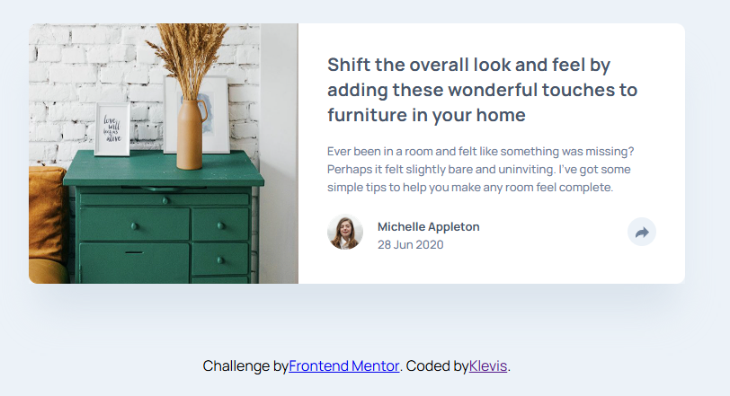
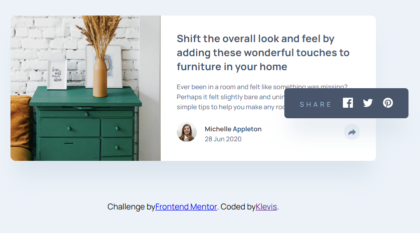

📰 Article Preview Component

A responsive Article Preview Component built as part of a Frontend Mentor challenge.
The project displays a blog article preview with author information and a share interaction.

🚀 Features

- Article preview card layout
- Article image and headline
- Author section with avatar
- Share button interaction
- Responsive layout for desktop and mobile
- Clean modern UI design

| Technology                | Purpose                  |
| ------------------------- | ------------------------ |
| **HTML5**                 | Semantic page structure  |
| **CSS3**                  | Styling and layout       |
| **JavaScript (optional)** | Share button interaction |
| **Flexbox / CSS Grid**    | Layout alignment         |
| **GitHub Pages**          | Deployment               |

📸 Screenshots

